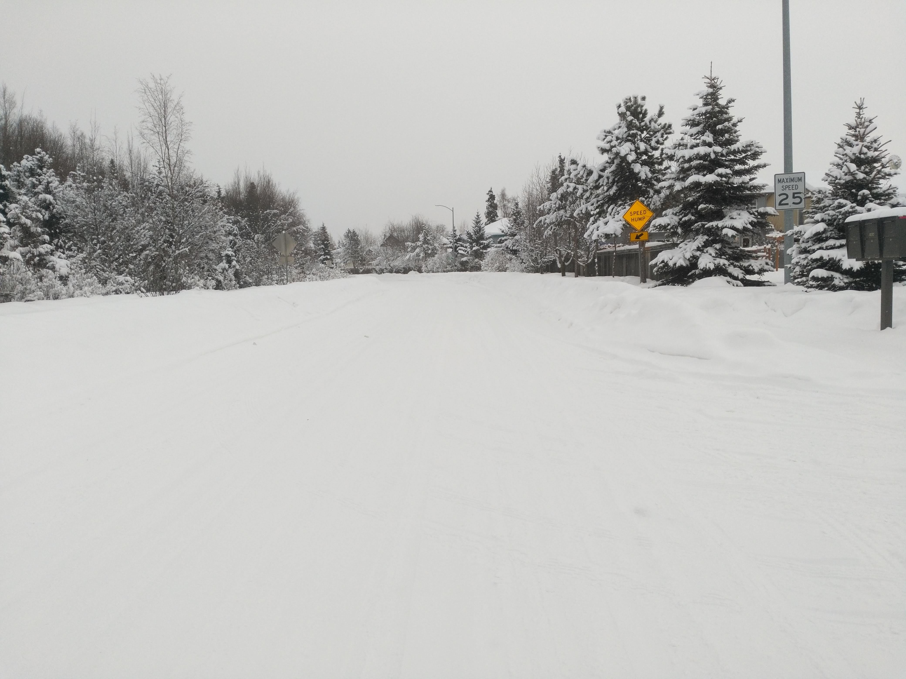

## Github for side projects or things I find interesting

#### Here is one of my favorite photos I like to show off

 

<!--
**907-ClubMember/907-ClubMember** is a ✨ _special_ ✨ repository because its `README.md` (this file) appears on your GitHub profile.

Here are some ideas to get you started:
https://stackoverflow.com/questions/14494747/how-to-add-images-to-readme-md-on-github
- 🔭 I’m currently working on ...
- 🌱 I’m currently learning ...
- 👯 I’m looking to collaborate on ...
- 🤔 I’m looking for help with ...
- 💬 Ask me about ...
- 📫 How to reach me: ...
- 😄 Pronouns: ...
- ⚡ Fun fact: ...
-->
